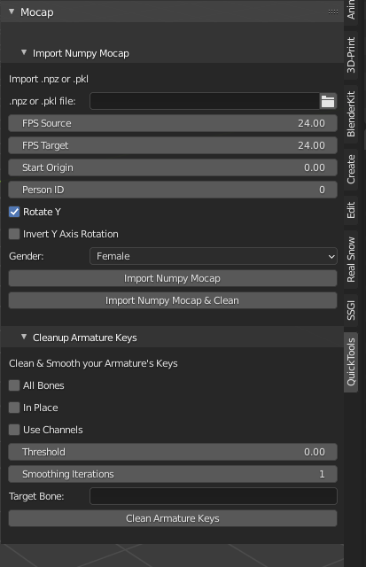

# Quick Mocap

Use this Blender Add-on to import & clean Mocap Pose data from .npz or .pkl files. These files may have been created using Numpy,  [ROMP](https://github.com/Arthur151/ROMP), or other motion capture processes that package the user files accordingly.



[v0.3.0 Overview Video](https://youtu.be/SFZan6cD83w)

# Requirements

The SMPL Unity .fbx models are needed. Please set the preference paths in the Add-on's Preference Panel (where you install the Add-on).
Sign-up and download the SMPL here:

[SMPL](https://smpl.is.tue.mpg.de/downloads)

```SMPL_f_unityDoubleBlends_lbs_10_scale5_207_v1.0.0.fbx```
```SMPL_m_unityDoubleBlends_lbs_10_scale5_207_v1.0.0.fbx```

# Bugs

Blender needs to be restarted when the user first installs the addon.

# Usage

## Import Mocap From .npz File

1. Import mocap in the form of a .npz or .pkl file. Set the file path in the ```.npz or .pkl file``` input field.

2. Set the FPS settings, along with the approipriate settings (example above).

3. Click one of the Import buttons, If you chose to Clean on import, please make sure either ```All Bones``` is checked below, or you set the ```Target Bone``` by name.

Your mocap should import. Give it a bit of time depending on your PC.


## Clean Armature Keys

1. Select the Armature to process in the hierarchy.

2. Use ```All Bones``` if you want to smooth / reduce all the bones, or  set the ```Target Bone``` by name.

3. Set ```In Place``` If you want the bone to be located at the (0,0,0) relative location.

4. Click the ```Clean Armature Keys``` button to clean the keys based on your settings.


# Programs Of Interest
- [ROMP](https://github.com/Arthur151/ROMP) Output .npk files are ready to be used by this add-on. It's as if it was tailor made for it.

# Acknowledgments
- Core SMPL Importer code was found in the [ROMP](https://github.com/Arthur151/ROMP) code for convert_fbx.py.
- Core SMPL importer written by Author: Joachim Tesch, Max Planck Institute for Intelligent Systems, Perceiving Systems
- Blender Addon & class implementation of the SMPL importer written by Justin Jaro for VLT Media.