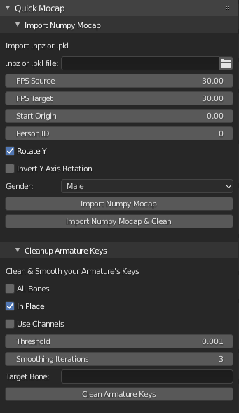

# Quick Mocap

Use this Blender Addon to import & clean Mocap Pose data from .npz or .pkl files. These files may have been created using Numpy, ROMP, or other motion capture processes that package their files accordingly.



[v0.3.0 Overview Video](https://youtu.be/8UheXOZDHY8)

# Requirements

The SMPL Unity .fbx models are needed. Please set their paths in the Addon's Preference Panel (where you install the Addon).
Signup and download from here:

[SMPL](https://smpl.is.tue.mpg.de/downloads)

```SMPL_f_unityDoubleBlends_lbs_10_scale5_207_v1.0.0.fbx```
```SMPL_m_unityDoubleBlends_lbs_10_scale5_207_v1.0.0.fbx```


# Usage

## Import Mocap From .npz File

1. Import some mocap in the form of a .npz or .pkl file. Set the file path in the ```.npz or .pkl file``` input field.

2. Set the FPS settings, along with the other settings.

3. Click one of the Import buttons, If you chose to Clean on import, please make sure either ```All Bones``` is checked below, or you set the explicit ```Target Bone``` by name.

Your mocap should import, give it a bit of time depending on your PC.


## Clean Armature Keys

1. Select Armature to process

2. Use ```All Bones``` if you want to smooth / reduce all the bones, or you the explicit ```Target Bone``` by name.

3. Set ```In Place``` If you want the bone to be located at (0,0,0) relative location.

4. Click the ```Clean Armature Keys``` button to clean the keys based on your settings.


